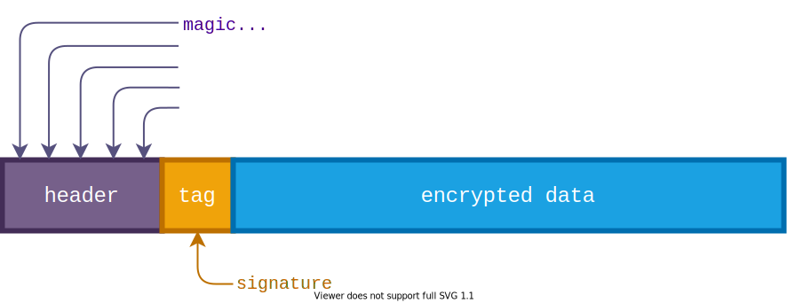

# Cocoon



`Cocoon` is a protected container to wrap sensitive data with a strong
[encryption](#cryptography) and format validation. A format of `Cocoon` is developed
for the following practical cases:

1. As a _file format_ to organize a simple secure storage:
   1. Key store.
   2. Password store.
   3. Sensitive data store.
2. For _encrypted data transfer_:
   * As a secure in-memory container.

# Problem

Every time when you need a secure storage you re-invent the wheel: you have to take care
how to encrypt data properly, how to store and transmit randomly generated
buffers, then to get data back, parse, and decrypt securely. Instead you can use `Cocoon`.

# Basic Usage

## Wrap/Unwrap

One party wraps a private data into a container using `Cocoon::wrap`.
Another party (or the same one, or whoever knows the password) unwraps a private data
out of the container using `Cocoon::unwrap`.

📌 `wrap`/`unwrap`
```rust
let cocoon = Cocoon::new(b"password");

let wrapped = cocoon.wrap(b"my secret data")?;
assert_ne!(&wrapped, b"my secret data");

let unwrapped = cocoon.unwrap(&wrapped)?;
assert_eq!(unwrapped, b"my secret data");
```

## Dump/Parse
📌 `dump`/`parse`

You can store data to file. Put data into `Vec` container, the data is going to be
encrypted _in place_ and stored in a file using the "cocoon" [format](#cocoon).
```rust
let mut data = b"my secret data".to_vec();
let cocoon = Cocoon::new(b"password");

cocoon.dump(data, &mut file)?;

let data = cocoon.parse(&mut file)?;
assert_eq!(&data, b"my secret data");
```

## Encrypt/Decrypt
📌 `encrypt`/`decrypt`

You can encrypt data in place and avoid re-allocations. The method operates with a detached
meta-data (a container format prefix) in the array on the stack. It is suitable for "`no_std`"
build and whenever you want to evade re-allocations of a huge amount of data. You have to care
how to store and transfer a data length and a container prefix though.
```rust
let mut data = "my secret data".to_owned().into_bytes();
let cocoon = Cocoon::from_crypto_rng(b"password", good_rng);

let detached_prefix = cocoon.encrypt(&mut data)?;
assert_ne!(data, b"my secret data");

cocoon.decrypt(&mut data, &detached_prefix)?;
assert_eq!(data, b"my secret data");
```

# Study Case
You implement a database of secrets which must be stored to an encrypted file using a user
password. There are a lot of ways how your database can be represented in memory and how
it could be serialized. You handle these aspects on your own, e.g. you can use
`HashMap` to manage data and use `borsh`, or `bincode`,
to serialize the data. You can even compress serialized buffer before encryption.

In the end you use `Cocoon` to put the final image into encrypted container.

```rust
use borsh::BorshSerialize;
use cocoon::{Cocoon, Error};

use std::collections::HashMap;
use std::fs::File;

#[derive(BorshSerialize)]
struct Database {
    inner: HashMap<String, String>,
}

fn main() -> Result<(), Error> {
    let mut file = File::create("target/doc/test.db")?;
    let mut db = Database { inner: HashMap::new() };

    db.inner.insert("my.email@example.com".to_string(), "eKPV$PM8TV5A2".to_string());

    let encoded = db.try_to_vec().unwrap();

    // Don't use the hard-coded password in the real life!
    // It could be a user-supplied password.
    let cocoon = Cocoon::new(b"secret password");

    // Dump serialized database into file as an encrypted container.
    let container = cocoon.dump(encoded, &mut file)?;

    Ok(())
}
```

# Cryptography

256-bit cryptography is chosen as a `Cocoon` baseline.

| Cipher (AEAD)     | Key Derivation Function (KDF)    |
|-------------------|----------------------------------|
| Chacha20-Poly1305 | PBKDF2-SHA256: 100000 iterations |
| AES256-GCM        |                                  |

* Key: 256-bit.
* Salt for KDF: random 128-bit + predefined part.
* Nonce for encryption: random 96-bit.

Key derivation parameters comply with NIST SP 800-132 recommendations (salt, iterations),
and cipher parameters (key, nonce, length) fit requirements of a particular cipher.
AEAD is chosen in order to authenticate an encrypted data together with an unencrypted header.